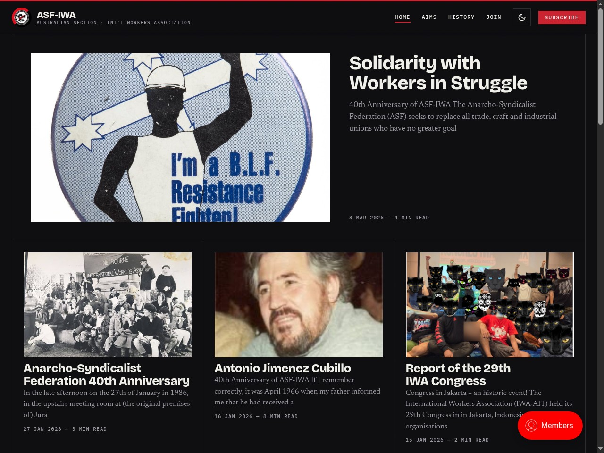

# Inkwell

A modern, dark-first [Ghost](https://ghost.org) theme with an editorial, type-driven aesthetic, fully white-label and reusable for any publication.

Example with custom logo etc.


## Features

- **Dark by default, with a light-mode toggle** (remembers the visitor's choice; respects OS preference; no flash on load).
- **Editorial hairline layout** — square corners, 1px grid, generous space, subtle print-grain texture.
- **Distinctive type** — Bricolage Grotesque (display), Newsreader (serif body), IBM Plex Mono (labels), all self-hosted.
- **Smooth scroll motion** — Lenis smooth scrolling, staggered scroll reveals, a scroll-progress bar and header elevation (GSAP ScrollTrigger). All progressively enhanced and disabled under `prefers-reduced-motion`.
- **White-label** — logo/emblem and key text are editable in Ghost admin (see *Customize*).
- **Ghost membership** — styled Portal/subscribe integration, members & newsletter ready.
- **Accessible & responsive** — keyboard navigation, AA contrast, mobile-first.
- Validated with `gscan` (compatible with Ghost 6.x).

## Requirements

- Ghost **5.0+** (works on Ghost 6.x).
- For building from source: Node.js 18+ and npm.

## Install (site owners)

1. Download `inkwell.zip` (from the [Releases](../../releases) page, or build it — see below).
2. In Ghost Admin go to **Settings → Design → Change theme → Upload theme**.
3. Upload the zip and **Activate**.

That's it — no build tools or servers needed to use the theme.

## Customize (no code)

In **Ghost Admin → Settings → Design**:

- **Brand** — set your site **title** (the wordmark) and accent via Ghost's own settings; configure the Portal/subscribe button under **Settings → Membership → Portal**.
- **Theme settings** (under the theme's section):
  - **Emblem** — upload a circular/square badge (defaults to the bundled mark).
  - **Header subtitle**, **Footer description**, **Footer motto** — short text lines.
  - **Subscribe heading / text** — the membership call-to-action copy.
  - *Leave any text field empty to hide that element.*
- **Navigation** and **social accounts** use Ghost's built-in settings.

## Develop

```bash
git clone <your-repo-url> inkwell
cd inkwell
npm install --legacy-peer-deps   # the --legacy-peer-deps flag is required (toolchain peer-dep)
npm run dev                      # compile CSS/JS and watch for changes
```

Preview against a local Ghost using **either**:

- **Existing local Ghost:** symlink (or copy) this folder into your Ghost install's
  `content/themes/`, then activate it in admin and run `npm run dev`:
  ```bash
  ln -s "$(pwd)" /path/to/ghost/content/themes/inkwell
  ```
- **Throwaway Ghost via Docker** (optional, one command):
  ```bash
  docker run -d -p 2368:2368 \
    -v "$(pwd)":/var/lib/ghost/content/themes/inkwell \
    ghost:5-alpine
  ```
  Open <http://localhost:2368/ghost> to set up, then activate **Inkwell** in
  Settings → Design, and run `npm run dev` on the host.

## Build & validate

```bash
npm run build   # production assets into assets/built/
npm test        # gscan theme validation
npm run zip     # package inkwell.zip for upload
```

## Tech

Ghost theme toolchain: Handlebars templates, **Rollup** (ES output with lazy code-split
chunks) + **PostCSS** (`postcss-preset-env`; design tokens, fluid type, container/`:has()`
queries), GSAP + Lenis for motion.

## Credits

Scaffolded from [TryGhost/Starter](https://github.com/TryGhost/Starter).

## License

[MIT](LICENSE).
